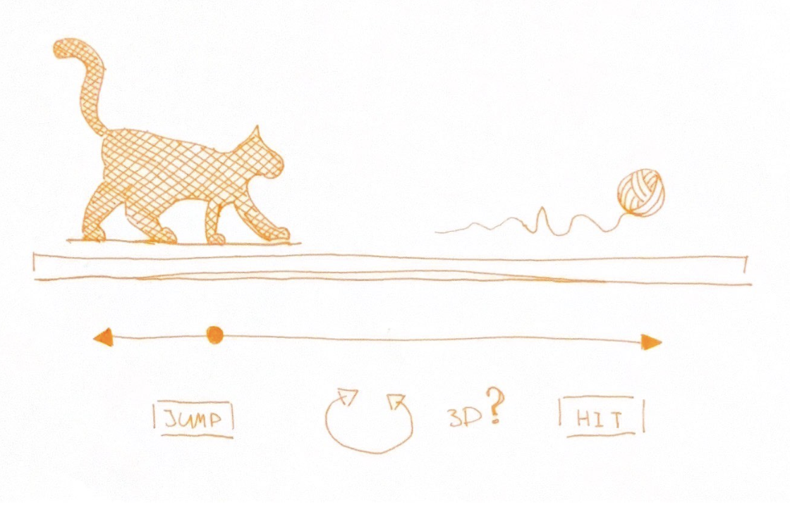
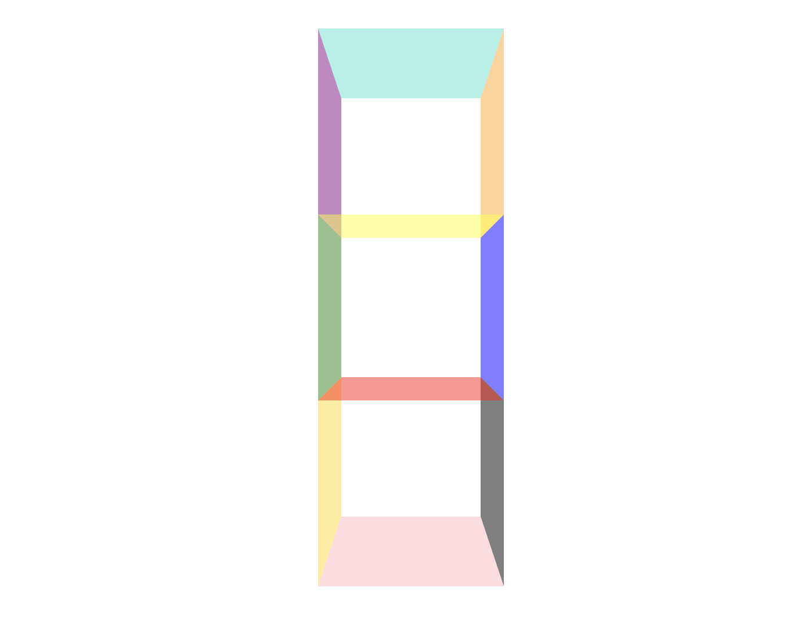

# CCS to the rescue <br> David Bijl

---

> ## Week 1
> **<sub><sup>24 feb t/m 28 feb</sup></sub>**

**Assignment:** <br>Control panel

**Concept:** <br>Bestuur de kat -> Mijn idee is om een 3D kat te bouwen met <code>perspective: ...;</code> & <code>transform-style: preserve-3d;</code>. Vervolgens wil ik dat de kat te besturen is met een control panel die uit een aantal knoppen en sliders bestaat. Ik heb de volgende acties bedacht:
<ul>
<li>Jump -> door op een knop te klikken springt de kat in de lucht</li>
<li>Walk -> door een slider te bewegen loopt de kat naar voren/achter</li>
<li>Wave -> door op een knop te klikken zwaait de kat met zijn pootje</li>
<li>Turn camera -> door een slider te bewegen draait de "camera" rond de "scene"</li>
</ul>

**Progressie:** <br>Tot nu toe heb ik een schets van de interface gemaakt om een globaal beeld te krijgen van wat ik ga ontwikkelen.<br>
<br>
Verder, ben ik bezig geweest met het expirimenteren binnen 3D css. Ik heb namelijk een soort cubesje gemaakt *(zie code ↓↓↓)*<br>

```
div {
    position: fixed;
    width: 10em;
    aspect-ratio: 1;
    opacity: .5;
}


.red {
    background-color: red;
    rotate: x 90deg;
    transform-origin: bottom center;
}

.blue {
    background-color: blue;
    translate: 5em 0 -5em;
    rotate: y 90deg;
    transform-origin: center center;
}

.green {
    background-color: green;
    translate: -5em 0 -5em;
    rotate: y 90deg;
    transform-origin: center center;
}

.yellow {
    background-color: yellow;
    rotate: x -90deg;
    transform-origin: top center;
}

etc...
```

Output ↓↓↓<br>


---

> ## Week 2
> **<sub><sup>1 t/m 5 mar</sup></sub>**

**Updates:** <br>updates hier...

---

> ## Week 3
> **<sub><sup>8 t/m 13 mar</sup></sub>**

**Updates:** <br>updates hier...

---

> ## Week 4
> **<sub><sup>16 t/m 21 mar</sup></sub>**

**Updates:** <br>updates hier...

---