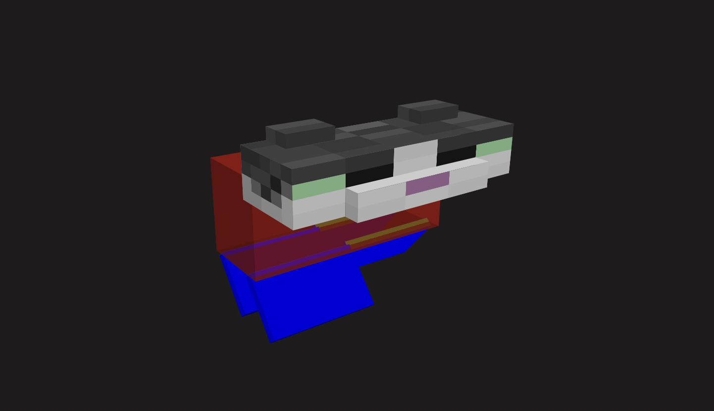

# CCS to the rescue <br> David Bijl

---

> ## Week 1
> **<sub><sup>24 feb t/m 28 feb</sup></sub>**

**Assignment:** <br>Control panel

**Concept:** <br>Bestuur de kat -> Mijn idee is om een 3D kat te bouwen met <code>perspective: ...;</code> & <code>transform-style: preserve-3d;</code>. Vervolgens wil ik dat de kat te besturen is met een control panel die uit een aantal knoppen en sliders bestaat. Ik heb de volgende acties bedacht:
<ul>
<li>Jump -> door op een knop te klikken springt de kat in de lucht</li>
<li>Walk -> door een slider te bewegen loopt de kat naar voren/achter</li>
<li>Wave -> door op een knop te klikken zwaait de kat met zijn pootje</li>
<li>Turn camera -> door een slider te bewegen draait de "camera" rond de "scene"</li>
</ul>

**Progressie:** <br>Tot nu toe heb ik een schets van de interface gemaakt om een globaal beeld te krijgen van wat ik ga ontwikkelen.<br>
<br>
Verder, ben ik bezig geweest met het expirimenteren binnen 3D css. Ik heb namelijk een soort cubesje gemaakt *(zie code ↓↓↓)*<br>

```
div {
    position: fixed;
    width: 10em;
    aspect-ratio: 1;
    opacity: .5;
}


.red {
    background-color: red;
    rotate: x 90deg;
    transform-origin: bottom center;
}

.blue {
    background-color: blue;
    translate: 5em 0 -5em;
    rotate: y 90deg;
    transform-origin: center center;
}

.green {
    background-color: green;
    translate: -5em 0 -5em;
    rotate: y 90deg;
    transform-origin: center center;
}

.yellow {
    background-color: yellow;
    rotate: x -90deg;
    transform-origin: top center;
}

etc...
```

Output ↓↓↓<br>


---

> ## Week 2
> **<sub><sup>3 t/m 7 mar</sup></sub>**

**Nieuw voor mij:**<br>
<ul>
    <li>custom HTML tags verzinnen :)</li>
    <li>Dat de alpha channel van een kleur binnen de HEX code al aangepast kan worden -> <code>#ff000050;</code></li>
    <li>Hoe je handig 3D vlakken positioneerd doormiddel van:
    <ul>
        <li><code>transform: translateX()</code></li>
        <li><code>transform: translateY()</code></li>
        <li><code>transform: translateZ()</code></li>
        <li>of de shorthand <code>translate: x y z</code></li>
    </ul>
    </li>
    <li>Pixel art met <code>linear gradient</code>'s</li>
</ul>

**Progressie:** <br>
Deze week stond in het teken van het nabouwen van de Minecraft-kat. Het was een leerzaam proces.  

Ik begon met het bouwen van het hoofd. Dit bestaat uit een grote kubus in het midden, met een klein kubusje aan de voorkant (de neus van de kat) en twee mini-kubusjes aan de bovenkant (de oren). Het was veel experimenteren, maar uiteindelijk kwam ik eruit!  

In het begin gebruikte ik nog geen custom variables; dat was de volgende stap. Ik wilde namelijk de dimensies van de kat kunnen aanpassen. Daarom ben ik de waarden gaan vervangen door <code>var()</code>'s en <code>calc()</code>'s. Dit was echter geen succes. Gaandeweg ging er iets mis, en na even debuggen besloot ik dat het sneller zou zijn om opnieuw te beginnen dan alles uit te zoeken.  

Nu ik wat meer ervaring had met 3D CSS, ging het allemaal eigenlijk best snel. Uiteindelijk is het me gelukt om de kat met werkende custom variables te bouwen.<br>




```
    /* normale dimensies */
    --torso-x: calc(var(--cat-x) * 4);
    --torso-y: calc(var(--cat-y) * 6);
    --torso-z: calc(var(--cat-z) * 16);
```

Volgende week is mijn doel om de kat helemaal af te maken:<br>
- De staart afmaken
- De textures volledig rondom afmaken.
Daarna wil ik gaan beginnen aan de interface zelf. Dus knoppen verzinnen en spelen met een slider.


---

> ## Week 3
> **<sub><sup>10 t/m 14 mar</sup></sub>**

**Updates:** <br>updates hier...

---

> ## Week 4
> **<sub><sup>17 t/m 21 mar</sup></sub>**

**Updates:** <br>updates hier...

---

> ## Bronnen

<ul>
    <li>ChadGPT -> voor allerlei kleine HTML en CSS controles een vraagjes</li>
    <li>https://css-tricks.com/things-watch-working-css-3d/ -> Suggestie van Sanne, een artikel over alles wat 3D css kapot maakt</li>
    <li>https://miocene.io/posts/3d-cube-with-css/3d-cube-with-css/ -> Inspiratie & uitleg over 3D css</li>
    <li>more to come...</li>
    <li>more to come...</li>
    <li>more to come...</li>
</ul>

---